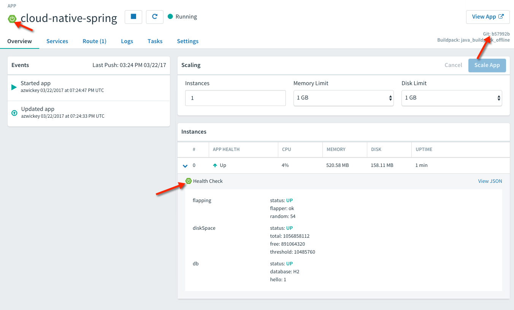
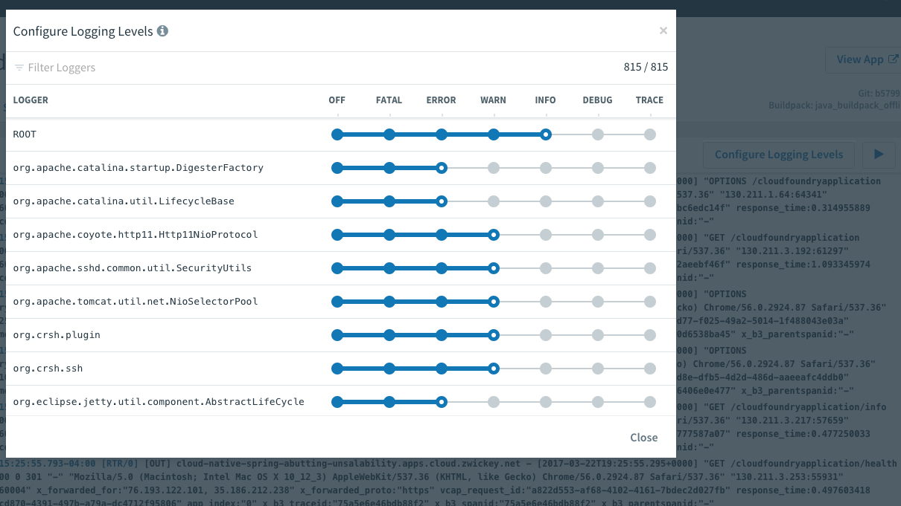

= Enhancing Boot Application with Metrics

== Set up the Actuator

Spring Boot includes a number of additional features to help you monitor and manage your application when it’s pushed to production. These features are added by adding _spring-boot-starter-actuator_ to the classpath.  Our initial project setup already included it as a dependency.

. Verify the Spring Boot Actuator dependency the in following file: */cloud-native-spring/build.gradle* You should see the following dependency in the list:
+
[source,groovy]
---------------------------------------------------------------------
dependencies {
    compile('org.springframework.boot:spring-boot-starter-actuator')
    // other dependencies omitted
}

---------------------------------------------------------------------
+
By default Spring Boot does not expose these management endpoints (which is a good thing!).  Though you wouldn't want to expose all of them in production, we'll do so in this sample app to make demonstration a bit easier and simpler.  

. Add the following properties to *cloud-native-spring/src/main/resources/application.yml*.
+
[source,yml]
---------------------------------------------------------------------
management:
  endpoints:
    web:
      exposure: 
        include: "*"
---------------------------------------------------------------------

. Run the updated application
+
[source,bash]
---------------------------------------------------------------------
gradle clean bootRun
---------------------------------------------------------------------
+
Try out the following endpoints with https://www.getpostman.com[Postman]. The output is omitted here because it can be quite large:
+
http :8080/actuator/health
+
-> Displays Application and Datasource health information.  This can be customized based on application functionality, which we'll do later.
+
http :8080/actuator/beans
+
-> Dumps all of the beans in the Spring context.
+
http :8080/actuator/autoconfig
+
-> Dumps all of the auto-configuration performed as part of application bootstrapping.
+
http :8080/actuator/configprops
+
-> Displays a collated list of all @ConfigurationProperties.
+
http :8080/actuator/env
+
-> Dumps the application’s shell environment as well as all Java system properties.
+
http :8080/actuator/mappings
+
-> Dumps all URI request mappings and the controller methods to which they are mapped.
+
http :8080/actuator/threaddump
+
-> Performs a thread dump.
+
http :8080/actuator/httptrace
+
-> Displays trace information (by default the last few HTTP requests).
+
http :8080/actuator/flyway
+
-> Shows any Flyway database migrations that have been applied.

. Stop the _cloud-native-spring_ application.

== Include Version Control Info

Spring Boot provides an endpoint (http://localhost:8080/actuator/info) that allows the exposure of arbitrary metadata. By default, it is empty.

One thing that _actuator_ does well is expose information about the specific build and version control coordinates for a given deployment.

. Edit the following file: */cloud-native-spring/build.gradle* Add the https://github.com/n0mer/gradle-git-properties[gradle-git-properties] plugin to your Gradle build. 
+
First, you'll need to be able to resolve the plugin so add the following to the _repositories{}_ section of the _buildscript{}_ block.
+
[source,groovy]
---------------------------------------------------------------------
maven {
    url "https://plugins.gradle.org/m2/"
}
---------------------------------------------------------------------
+
Then, you must edit the file and add the plugin dependency within the _dependencies{}_ section of the _buildscript{}_ block. 
+
[source,groovy]
---------------------------------------------------------------------
classpath("gradle.plugin.com.gorylenko.gradle-git-properties:gradle-git-properties:2.0.0-beta1")
---------------------------------------------------------------------
+
You'll also activate the plugin and add a _gitProperties{}_ block just underneath the last _apply plugin:_ line.
+
[source,groovy]
---------------------------------------------------------------------
apply plugin: 'com.gorylenko.gradle-git-properties'

gitProperties {
    dateFormat = "yyyy-MM-dd'T'HH:mmZ"
    dateFormatTimeZone = "UTC"
    dotGitDirectory = "${project.rootDir}/../../.."
}
---------------------------------------------------------------------
+
-> Note too that we are updating the path to the _.git_ directory.
+
The effect of all this configuration is that the _gradle-git-properties_ plugin adds Git branch and commit coordinates to the */actuator/info* endpoint.

. Run the _cloud-native-spring_ application:
+
  gradle clean bootRun

. Let's use httpie to verify that Git commit information is now included 
+
[source,bash]
---------------------------------------------------------------------
http :8080/actuator/info
---------------------------------------------------------------------
+
[source,json]
---------------------------------------------------------------------
{
    "git": {
        "commit": {
            "time": "2017-09-07T13:52+0000",
            "id": "3393f74"
        },
        "branch": "master"
    }
}
---------------------------------------------------------------------

. Stop the _cloud-native-spring_ application
+
*What Just Happened?*
+
By including the _gradle-git-properties_ plugin, details about git commit information will be included in the */actuator/info* endpoint. Git information is captured in a _git.properties_ file that is generated with the build. Review the following file: */cloud-native-spring/build/resources/main/git.properties*

== Include Build Info

. Add the following properties to *cloud-native-spring/src/main/resources/application.yml*.
+
[source,yml]
---------------------------------------------------------------------
info: # add this section
  build:
    artifact: @project.artifactId@
    name: @project.name@
    description: @project.description@
    version: @project.version@
---------------------------------------------------------------------
+
Note we're defining token delimited value-placeholders for each property.  In order to have these properties replaced, we'll need to add some further instructions to the _build.gradle_ file.
+
-> if STS https://jira.spring.io/browse/STS-4201[reports a problem] with the application.yml due to @ character, the problem can safely be ignored.

. Add the following directly underneath the _gitProperties{}_ block within *cloud-native-spring/build.gradle*
+
[source,groovy]
---------------------------------------------------------------------
import org.apache.tools.ant.filters.*

processResources {
    filter ReplaceTokens, tokens: [
        "application.name": project.property("application.name"),
        "application.description": project.property("application.description"),
        "application.version": project.property("version")
    ]
}
---------------------------------------------------------------------

. Build and run the _cloud-native-spring_ application:
+
[source,bash]
---------------------------------------------------------------------
gradle clean bootRun
---------------------------------------------------------------------

. Again we'll use httpie to verify that the Build information is now included 
+
[source,bash]
---------------------------------------------------------------------
http :8080/actuator/info
---------------------------------------------------------------------
+
[source,json]
---------------------------------------------------------------------
{
    "build": {
        "name": "Cloud Native Spring (Back-end)",
        "description": "Simple Spring Boot application employing an in-memory relational data-store and which exposes a set of REST APIs",
        "version": "1.0-SNAPSHOT"
    },
    "git": {
        "commit": {
            "time": "2017-09-07T13:52+0000",
            "id": "3393f74"
        },
        "branch": "master"
    }
}
---------------------------------------------------------------------

. Stop the cloud-native-spring application.
+
*What Just Happened?*
+
We have mapped Gradle properties into the /actuator/info endpoint.
+
Read more about exposing data in the /actuator/info endpoint link:https://docs.spring.io/spring-boot/docs/current/reference/htmlsingle/#production-ready[here]

== Health Indicators

Spring Boot provides an endpoint http://localhost:8080/actuator/health that exposes various health indicators that describe the health of the given application.

Normally, the /actuator/health endpoint will only expose an UP or DOWN value.

[source,json]
---------------------------------------------------------------------
{
  "status": "UP"
}
---------------------------------------------------------------------
+
We want to expose more detail about the health and well-being of the application, so we're going to need a bit more configuration to _cloud-native-spring/src/main/resources/application.yml_, underneath the _management_ prefix, add
+
[source,yml]
---------------------------------------------------------------------
  endpoint:
    health:
      show-details: always
---------------------------------------------------------------------

. Run the cloud-native-spring application:
+
[source,bash]
---------------------------------------------------------------------
gradle bootRun
---------------------------------------------------------------------

. Use httpie to verify the output of the health endpoint
+
[source,bash]
---------------------------------------------------------------------
http :8080/actuator/health
--------------------------------------------------------------------- 
+
Out of the box is a _DiskSpaceHealthIndicator_ that monitors health in terms of available disk space. Would your Ops team like to know if the app is close to running out of disk space? DiskSpaceHealthIndicator can be customized via _DiskSpaceHealthIndicatorProperties_. For instance, setting a different threshold for when to report the status as DOWN.
+
[source,json]
---------------------------------------------------------------------
{
    "status": "UP",
    "details": {
        "diskSpace": {
            "status": "UP",
            "details": {
                "total": 499963170816,
                "free": 375287070720,
                "threshold": 10485760
            }
        },
        "db": {
            "status": "UP",
            "details": {
                "database": "H2",
                "hello": 1
            }
        }
    }
}
---------------------------------------------------------------------

. Stop the cloud-native-spring application.

. Create the class _io.pivotal.FlappingHealthIndicator_ (/cloud-native-spring/src/main/java/io/pivotal/FlappingHealthIndicator.java) and into it paste the following code:
+
[source,java]
---------------------------------------------------------------------
package io.pivotal;

import java.util.Random;

import org.springframework.boot.actuate.health.Health;
import org.springframework.boot.actuate.health.HealthIndicator;
import org.springframework.stereotype.Component;

@Component
public class FlappingHealthIndicator implements HealthIndicator {

    private Random random = new Random(System.currentTimeMillis());

    @Override
    public Health health() {
        int result = random.nextInt(100);
        if (result < 50) {
            return Health.down().withDetail("flapper", "failure").withDetail("random", result).build();
        } else {
            return Health.up().withDetail("flapper", "ok").withDetail("random", result).build();
        }
    }
}
---------------------------------------------------------------------
+
This demo health indicator will randomize the health check.

. Build and run the _cloud-native-spring_ application:
+
[source,bash]
---------------------------------------------------------------------
$ gradle clean bootRun
---------------------------------------------------------------------

. Browse to http://localhost:8080/actuator/health and verify that the output is similar to the following (and changes randomly!).
+
[source,json]
---------------------------------------------------------------------
{
    "status": "UP",
    "details": {
        "flapping": {
            "status": "UP",
            "details": {
                "flapper": "ok",
                "random": 63
            }
        },
        "diskSpace": {
            "status": "UP",
            "details": {
                "total": 499963170816,
                "free": 375287070720,
                "threshold": 10485760
            }
        },
        "db": {
            "status": "UP",
            "details": {
                "database": "H2",
                "hello": 1
            }
        }
    }
}
---------------------------------------------------------------------

== Metrics

Spring Boot provides an endpoint http://localhost:8080/actuator/metrics that exposes several automatically collected metrics for your application. It also allows for the creation of custom metrics.

. Browse to http://localhost:8080/actuator/metrics. Review the metrics exposed.
+
[source,json]
---------------------------------------------------------------------
{
    "names": [
        "jvm.memory.max",
        "http.server.requests",
        "jdbc.connections.active",
        "process.files.max",
        "jvm.gc.memory.promoted",
        "tomcat.cache.hit",
        "system.load.average.1m",
        "tomcat.cache.access",
        "jvm.memory.used",
        "jvm.gc.max.data.size",
        "jdbc.connections.max",
        "jdbc.connections.min",
        "jvm.gc.pause",
        "jvm.memory.committed",
        "system.cpu.count",
        "logback.events",
        "tomcat.global.sent",
        "jvm.buffer.memory.used",
        "tomcat.sessions.created",
        "jvm.threads.daemon",
        "system.cpu.usage",
        "jvm.gc.memory.allocated",
        "tomcat.global.request.max",
        "hikaricp.connections.idle",
        "hikaricp.connections.pending",
        "tomcat.global.request",
        "tomcat.sessions.expired",
        "hikaricp.connections",
        "jvm.threads.live",
        "jvm.threads.peak",
        "tomcat.global.received",
        "hikaricp.connections.active",
        "hikaricp.connections.creation",
        "process.uptime",
        "tomcat.sessions.rejected",
        "process.cpu.usage",
        "tomcat.threads.config.max",
        "jvm.classes.loaded",
        "hikaricp.connections.max",
        "hikaricp.connections.min",
        "jvm.classes.unloaded",
        "tomcat.global.error",
        "tomcat.sessions.active.current",
        "tomcat.sessions.alive.max",
        "jvm.gc.live.data.size",
        "tomcat.servlet.request.max",
        "hikaricp.connections.usage",
        "tomcat.threads.current",
        "tomcat.servlet.request",
        "hikaricp.connections.timeout",
        "process.files.open",
        "jvm.buffer.count",
        "jvm.buffer.total.capacity",
        "tomcat.sessions.active.max",
        "hikaricp.connections.acquire",
        "tomcat.threads.busy",
        "process.start.time",
        "tomcat.servlet.error"
    ]
}
---------------------------------------------------------------------

. Stop the cloud-native-spring application.

== Deploy _cloud-native-spring_ to Pivotal Cloud Foundry

. When running a Spring Boot application on Pivotal Cloud Foundry with the actuator endpoints enabled, you can visualize actuator management information on the Applications Manager app dashboard.  To enable this there are a few properties we need to add.  Add the following to */cloud-native-spring/src/main/resources/application.yml*:
+
[source, yaml]
---------------------------------------------------------------------
---
spring:
  profiles: cloud

management:
  cloudfoundry:
    enabled: true
    skip-ssl-validation: true
---------------------------------------------------------------------

. Let's review */cloud-native-spring/build.gradle*.  Note these lines:
+
[source, groovy]
---------------------------------------------------------------------
jar {
    enabled = true
    excludes = ['**/application.yml']
}

bootJar {
    enabled = true
    classifier = 'exec'
}
---------------------------------------------------------------------
+
-> Note the _bootJar_ plugin repackages the original artifact and creates a separate classified artifact. We wind up with 2 .jar files.

. Push application into Cloud Foundry
+
  gradle build
  cf push

. Find the URL created for your app in the health status report. Browse to your app.  Also view your application details in the Apps Manager UI:
+

. From this UI you can also dynamically change logging levels:
+

*Congratulations!* You’ve just learned how to add health and metrics to any Spring Boot application.
