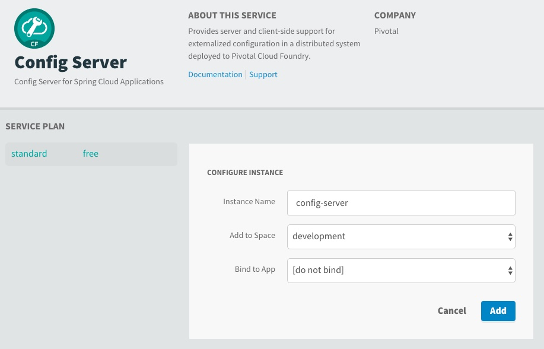
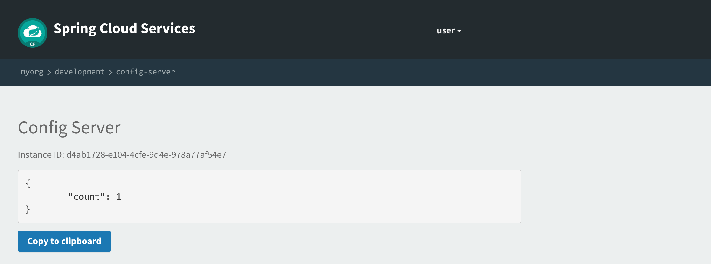
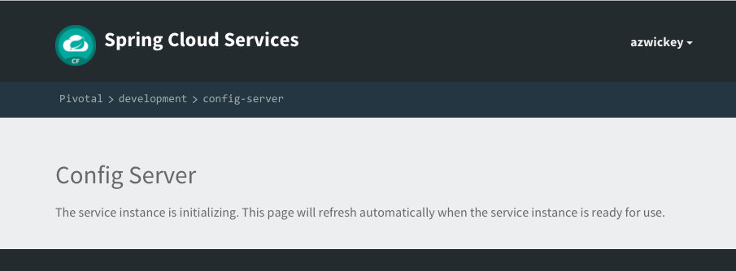

= Adding Spring Cloud Config to Boot Application

In this lab we'll utilize Spring Boot and Spring Cloud to configure our application from a configuration dynamically retrieved from a Git repository. We'll then deploy it to Pivotal Cloud Foundry and auto-provision an instance of a configuration server using Pivotal Spring Cloud Services.

== Update _Hello_ REST service

These features are added by adding _spring-cloud-services-starter-config-client_ to the classpath.  

. Open your Gradle build file, found here: */cloud-native-spring/build.gradle*.  We're going to make a few changes, consult the image below. You will want to include all the red highlighted updates on the right-handside of the image below.
+
image::images/beyond-compare-lab03-to-lab04-build.gradle.png[]

. Add an _@Value_ annotation, private field, and update the existing _@RequestMapping_ annotated method to employ it in _io.pivotal.controller.GreetingController_ (/cloud-native-spring/src/main/java/io/pivotal/controller/GreetingController.java):
+
[source, java]
---------------------------------------------------------------------
    @Value("${greeting:Hola}")
    private String greeting;

    @RequestMapping("/hello")
    public String hello() {
        return String.join(" ", greeting, "World!");
    }
---------------------------------------------------------------------

. Add a http://static.javadoc.io/org.springframework.cloud/spring-cloud-commons-parent/1.1.9.RELEASE/org/springframework/cloud/context/scope/refresh/RefreshScope.html[@RefreshScope] annotation to the top of the _GreetingController_ class declaration
+
[source, java]
---------------------------------------------------------------------
@RefreshScope
@RestController
public class GreetingController {
---------------------------------------------------------------------
+
Completed:
+
[source,java]
---------------------------------------------------------------------
package io.pivotal.controller;

import org.springframework.web.bind.annotation.RestController;
import org.springframework.web.bind.annotation.RequestMapping;
import org.springframework.beans.factory.annotation.Value;
import org.springframework.cloud.context.scope.refresh.RefreshScope;

@RefreshScope
@RestController
public class GreetingController {

    @Value("${greeting:Hola}")
    private String greeting;

    @RequestMapping("/hello")
    public String hello() {
        return String.join(" ", greeting, "World!");
    }
    
}
---------------------------------------------------------------------

. When we introduced the Spring Cloud Services Starter Config Client dependency Spring Security will also be included (Config servers will be protected by OAuth2).  However, this will also enable basic authentication to all our service endpoints.  Add the following configuration to */cloud-native-spring/src/main/resources/application.yml*:
+
[source, yaml]
---------------------------------------------------------------------
security:
  basic:
    enabled:  false
---------------------------------------------------------------------

. We'll also want to give our Spring Boot App a name so that it can lookup application-specific configuration from the config server later.  Add the following configuration to */cloud-native-spring/src/main/resources/bootstrap.yml*. (You'll need to create this file.)
+
[source, yaml]
---------------------------------------------------------------------
spring:
  application:
    name: cloud-native-spring
---------------------------------------------------------------------

== Run the _cloud-native-spring_ Application and verify dynamic config is working

. Run the application
+
[source,bash]
---------------------------------------------------------------------
gradle clean bootRun
---------------------------------------------------------------------

. Browse to http://localhost:8080/hello and verify you now see your new greeting.

. Stop the _cloud-native-spring_ application

== Create Spring Cloud Config Server instance

. Now that our application is ready to read its config from a Cloud Config server, we need to deploy one!  This can be done through Cloud Foundry using the services Marketplace.  Browse to the Marketplace in Pivotal Cloud Foundry Apps Manager, navigate to the Space you have been using to push your app, and select Config Server:
+
image::images/config-scs.jpg[]

. In the resulting details page, select the _standard_, single tenant plan.  Name the instance *config-server*, select the Space that you've been using to push all your applications.  At this time you don't need to select an application to bind to the service:
+

. After we create the service instance you'll be redirected to your _Space_ landing page that lists your apps and services.  The config server is deployed on-demand and will take a few moments to deploy.  Once the messsage _The Service Instance is Initializing_ disappears click on the service you provisioned.  Select the Manage link towards the top of the resulting screen to view the instance id and a JSON document with a single element, count, which validates that the instance provisioned correctly:
+

. We now need to update the service instance with our GIT repository information.  Using the Cloud Foundry CLI execute the following update service command:
+
[source,bash]
---------------------------------------------------------------------
cf update-service config-server -c '{"git": { "uri": "https://github.com/pacphi/config-repo" } }'
---------------------------------------------------------------------

. Refresh you Config Server management page and you will see the following message.  Wait until the screen refreshes and the service is reintialized:
+

. We will now bind our application to our config-server within our Cloud Foundry deployment manifest.  Add these entries to the bottom of */cloud-native-spring/manifest.yml*
+
[source, yml]
---------------------------------------------------------------------
  services:
  - config-server
---------------------------------------------------------------------
+
Complete:
+
[source, yml]
---------------------------------------------------------------------
---
applications:
- name: cloud-native-spring
  host: cloud-native-spring-${random-word}
  memory: 1024M
  instances: 1
  path: ./target/cloud-native-spring-1.0-SNAPSHOT-exec.jar
  buildpack: java_buildpack
  timeout: 180
  env:
    JAVA_OPTS: -Djava.security.egd=file:///dev/urandom
  services:
  - config-server
---------------------------------------------------------------------

== Deploy and test application

. Build the application
+
[source,bash]
---------------------------------------------------------------------
gradle clean bootRepackage
---------------------------------------------------------------------

. Push application into Cloud Foundry
+
[source,bash]
---------------------------------------------------------------------
cf push
---------------------------------------------------------------------

. Test your application by navigating to the /hello endpoint of the application.  You should now see a greeting that is read from the Cloud Config Server!
+
Ohai World!
+
*What just happened??*
+ 
-> A Spring component within the Spring Cloud Starter Config Client module called a _service connector_ automatically detected that there was a Cloud Config service bound into the application.  The service connector configured the application automatically to connect to the Cloud Config Server and downloaded the configuration and wired it into the application

. If you navigate to the Git repo we specified for our configuration, https://github.com/pacphi/config-repo, you'll see a file named _cloud-native-spring.yml_.  This filen ame is the same as our _spring.application.name_ value for our Boot application.  The configuration is read from this file, in our case the following property:
+
[source, yaml]
---------------------------------------------------------------------
greeting: Ohai
---------------------------------------------------------------------

. Next we'll learn how to register our service with a Service Registry and load balance requests using Spring Cloud components.
