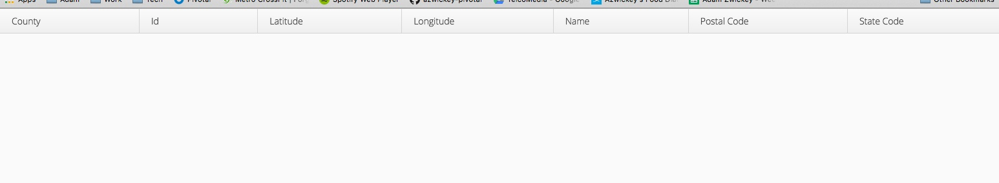
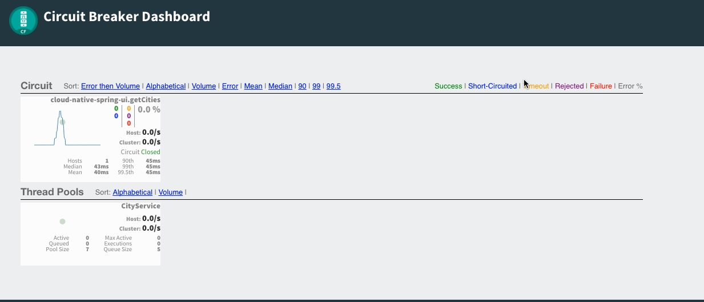

= Employing a circuit breaker

In this lab we'll utilize Spring Boot and Spring Cloud to make our UI Application more resilient.  We'll leverage Spring Cloud Circuit Breaker to configure our application behavior when our downstream dependencies are not available.  Finally, we'll use the circuit break dashboard to view metrics of the circuit breaker we implemented, which will be auto-provisioned within Cloud Foundry Pivotal Spring Cloud Services.

== Define a Circuit Breaker within the _UI Application_

. These features are added by adding _spring-cloud-services-starter-circuit-breaker_ to the classpath.  Open your Gradle build file, found here: */cloud-native-spring-ui/build.gradle*.  Add the following Spring Cloud Services dependency:
+
[source, groovy]
---------------------------------------------------------------------
dependencies {
	// add this dependency
	compile('io.pivotal.spring.cloud:spring-cloud-services-starter-circuit-breaker')
}
---------------------------------------------------------------------

. The first thing we need to add to our application is an _@EnableCircuitBreaker_ annotation to the Spring Boot application.  Add this annotation below the other ones on the _CloudNativeSpringUiApplication_ declaration in the class _io.pivotal.CloudNativeSpringUiApplication_ (/cloud-native-spring-ui/src/main/java/io/pivotal/CloudNativeSpringUiApplication.java):
+
[source, java]
---------------------------------------------------------------------
@SpringBootApplication
@EnableFeignClients
@EnableDiscoveryClient
@EnableCircuitBreaker
public class CloudNativeSpringUiApplication {
---------------------------------------------------------------------

. When we introduced an _@FeignClient_ into our application we were only required to provide an interface.  We'll provide a dummy class that implements that interface for our fallback.  We'll also reference that class as a fallback in our _@FeignClient_ annotation.  First, create this class in the _io.pivotal_ package:
+
[source, java]
---------------------------------------------------------------------
@Component
public class CityClientFallback implements CityClient {
	@Override
	public Resources<City> getCities() {
		//We'll just return an empty response
		return new Resources<City>(Collections.emptyList());
	}
}
---------------------------------------------------------------------

. Also modify the _@FeignClient_ annotation to reference this class as the fallback in case of failure:
+
[source, java]
---------------------------------------------------------------------
@FeignClient(name = "https://cloud-native-spring", fallback = CityClientFallback.class)
public interface CityClient {
---------------------------------------------------------------------

== Create the Circuit Breaker Dashboard

.  When we modified our application to use a Hystrix Circuit Breaker our application automatically begins streaming out metrics about the health of our methods wrapped with a HystrixCommand.  We can stream these events through a AMQP message bus into Turbine to view on a Circuit Breaker dashboard.  This can be done through cloudfoundry using the services marketplace by executing the following command:
+
[source,bash]
---------------------------------------------------------------------
cf create-service p-circuit-breaker-dashboard standard circuit-breaker
---------------------------------------------------------------------

. If we view the Circuit Breaker Dashboard (accessible from the _Manage_ link in Apps Manager) you will see that a dashboard has been deployed but is empty (You may get an _Initializing_ message for a few seconds.  This should eventually refresh to a dashboard):
+
image::images/dash.jpg[]

. We will now bind our application to our _circuit-breaker-dashboard_ within our Cloud Foundry deployment manifest.  Add this additional reference to a service at the bottom of */cloud-native-spring-ui/manifest.yml* in the services list:
+
[source, yml]
---------------------------------------------------------------------
  services:
  - service-registry
  - circuit-breaker
---------------------------------------------------------------------

== Deploy and test application

. Build the application
+
[source,bash]
---------------------------------------------------------------------
gradle bootRepackage -x test
---------------------------------------------------------------------

. Push application into Cloud Foundry
+
[source,bash]
---------------------------------------------------------------------
cf push
---------------------------------------------------------------------

. Test your application by navigating to the root URL of the application.  If the dependent cities REST service is still stopped, you should simply see a blank table.  Remember that last time you received a nasty exception in the browser?  Now your Circuit Breaker fallback method is automatically called and the fallback behavior is executed.
+

. From a commandline start the _cloud-native-spring_ microservice (the original City service, not the new UI)
+
[source,bash]
---------------------------------------------------------------------
cf start cloud-native-spring
---------------------------------------------------------------------

. Refresh the UI app and you should once again see a table listing the first page of cities.
+
image::../lab05/images/ui.jpg[]

. Refresh your UI application a few times to force some traffic though the circuit breaker call path.  After doing this you should now see the dashboard populated with metrics about the health of your Hystrix circuit breaker:
+

