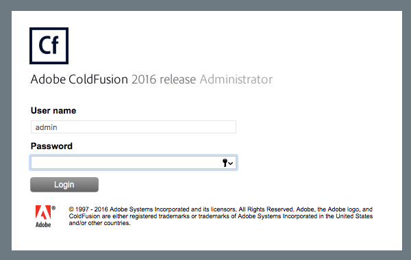
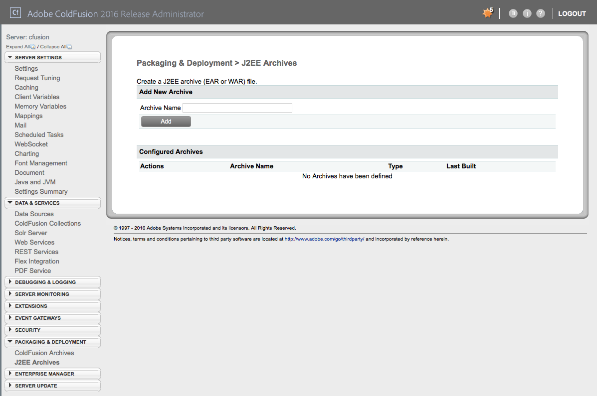
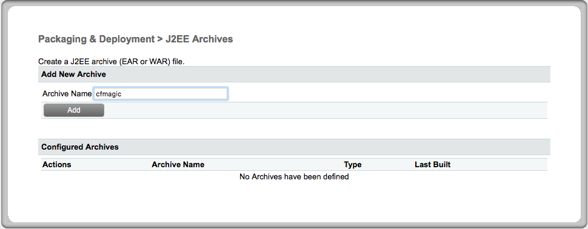
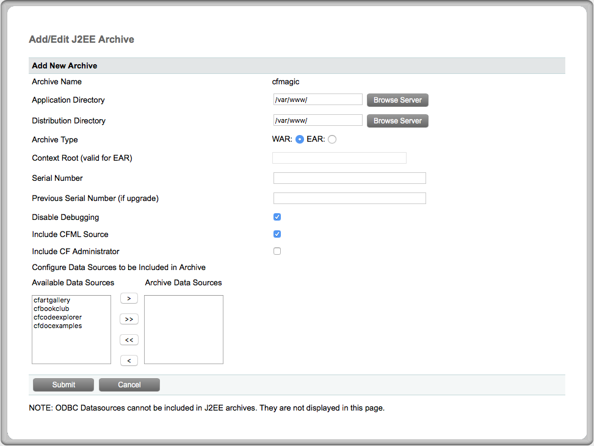

= Cold Fusion example

This sample application employs http://www.adobe.com/products/coldfusion-standard.html[Cold Fusion] and an assortment of https://helpx.adobe.com/coldfusion/cfml-reference/coldfusion-tags/tag-summary.html[tags] (e.g., cfset, cfloop, and cfhttp).

== Prerequisites

. Cold Fusion server administrator access

== How was this project template generated?

. Install Docker
+ 
-> https://www.docker.com/docker-mac[Docker for Mac]
+
-> https://www.docker.com/docker-windows[Docker for Windows 10]

. Employ a https://hub.docker.com/r/accent/coldfusion2016/[Docker image] to spin up an instance of Cold Fusion Server 2016
+
[source, bash]
-----------------------------------------------------------------
mkdir ~/.cold-fusion/2016
docker run -d --name="my-adobe-cold-fusion-2016-instance" -p 80:80 -p 8500:8500 -v ~/.cold-fusion/2016:/var/www accent/coldfusion2016
-----------------------------------------------------------------
+
-> Note: `~` represents the current user's home directory.  On *nix operating systems like Mac OS X and Linux, this equates to e.g., `/Users/home/waldo` or `/home/waldo`.  On Windows, this would typically be `C:\Users\waldo`.

. Login to the Release Administrator http://localhost:8500/CFIDE/administrator[console] via a web browser, credentials are `admin/Adm1n!12`
+

. Click on the _Packaging and Deployment_ menu option on the left hand-side, then click on _J2EE Archives_
+

. Specify an _Archive Name_ and click the _Add_ button
+

. Specify `/var/www` for both the _Application Directory_ and the _Distribution Directory_. Make sure the _Archive type_ is set to _WAR_.  Uncheck the _Include CF Administrator_ checkbox, then click the _Submit_ button.
+

. Change directories to `~/.cold-fusion/2016` and look for the `.war` you just created

. Rename the file to have a `.zip` extension
+
[source, bash]
-----------------------------------------------------------------
mv {filename}.war {filename}.zip
-----------------------------------------------------------------
+
-> Note: `{filename}` is the name of the `.war` file

. Unpack the contents of the file and remove the `CFIDE` directory
+
[source, bash]
-----------------------------------------------------------------
unzip -q {filename}.zip -d {project-root-directory}/src/main/webapp
rm -Rf src/main/webapp/CFIDE
-----------------------------------------------------------------
+
This is the heart of your project.  You can feel free to edit `index.cfm` and add additional file resources to this structure as you see fit.
+
-> Note: `{project-root-directory}` is the top-level directory for your Cold Fusion project, e.g., `/Users/waldo/development/projects/cfmagic`.

. Gradle-ize the project.  (Have a look at https://nebula-plugins.github.io[Nebula] for some good ideas).

== How to Build

. Unzip `cfmagic.zip` into `src/main/webapp` (removing unnecessary `CFIDE` directory)
+
[source, bash]
-----------------------------------------------------------------
unzip -q cfmagic.zip -d ./src/main/webapp
rm -Rf ./src/main/webapp/CFIDE
-----------------------------------------------------------------

. (Optionally) Develop! (e.g., edit the existing `index.cfm` file and/or add other resources underneath the `src/main/webapp` directory)

. Use gradle to package a .war file from source
+
[source, bash]
-----------------------------------------------------------------
gradle war
-----------------------------------------------------------------

== How to Deploy

. Deploy the application with
+
[source, bash]
-----------------------------------------------------------------
cf push
-----------------------------------------------------------------

== Limitations

You will not be able to leverage all the capabilities of ColdFusion without customizing the standard Java Buildpack.

=== Helpful links

-> https://forums.adobe.com/thread/2115839[CF2016 - Alias for /cf_scripts/scripts in the Built-In Web Server]

-> http://wwwimages.adobe.com/content/dam/acom/en/products/coldfusion/pdfs/coldfusion-2016-lockdown-guide.pdf[ColdFusion (2016 release) Lockdown Guide]

-> https://docs.cloudfoundry.org/buildpacks/custom.html[Creating Custom Buildpacks]